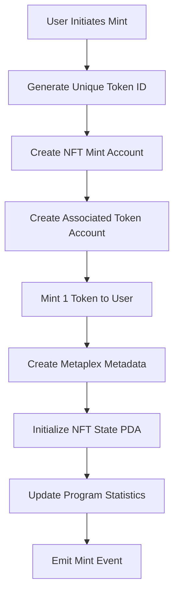
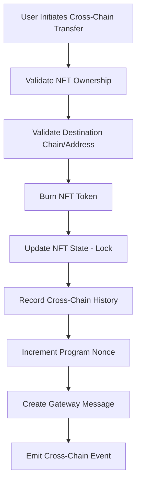
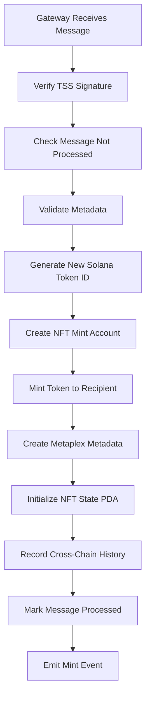

# Universal NFT Program - Technical Architecture

## 🏛️ System Overview

The Universal NFT Program is a sophisticated cross-chain infrastructure built on Solana that enables seamless NFT transfers between Solana and other blockchain networks via ZetaChain's interoperability protocol.

## 📐 Architectural Principles

### 1. **Security-First Design**
- Threshold Signature Scheme (TSS) integration for cross-chain authentication
- Nonce-based replay protection
- Comprehensive access control and authority validation
- Secure burn-mint mechanism with state consistency guarantees

### 2. **Solana-Native Optimization**
- Compute budget efficient operations (< 200,000 CU per instruction)
- Rent exemption for all program-derived accounts
- Optimized PDA derivation with stored bump seeds
- Efficient Associated Token Account management

### 3. **Cross-Chain Interoperability**
- ZetaChain gateway protocol integration
- Standardized message format across chains
- Bidirectional asset transfer support
- Comprehensive error recovery mechanisms

## 🔧 Core Components

### Program Structure
```
universal-nft-program/
├── lib.rs              # Main program entry point
├── constants.rs        # Program constants and limits
├── errors.rs          # Custom error definitions
├── state.rs           # Account structures and PDAs
├── utils.rs           # Helper functions and cryptography
└── instructions/      # Instruction handlers
    ├── initialize_program.rs
    ├── mint_nft.rs
    ├── burn_for_cross_chain.rs
    ├── mint_from_cross_chain.rs
    ├── gateway_handlers.rs
    └── update_config.rs
```

## 📊 Account Architecture

### 1. ProgramConfig Account
```rust
pub struct ProgramConfig {
    pub authority: Pubkey,           // Program admin
    pub gateway_program_id: Pubkey,  // ZetaChain gateway
    pub tss_address: [u8; 20],      // Ethereum-style TSS address
    pub collection_mint: Pubkey,     // Collection NFT mint
    pub nonce: u64,                 // Replay protection counter
    pub total_nfts_minted: u64,     // Program statistics
    pub is_initialized: bool,        // Initialization flag
    // ... additional fields
}
```
**PDA Seeds**: `["universal_nft_program"]`

### 2. NftState Account
```rust
pub struct NftState {
    pub mint: Pubkey,                      // NFT mint address
    pub original_owner: Pubkey,            // First owner
    pub token_id: u64,                     // Unique cross-chain ID
    pub chain_origin: u64,                 // Origin chain ID
    pub cross_chain_history: Vec<Transfer>, // Transfer history
    pub is_cross_chain_locked: bool,       // Lock status
    pub metadata_hash: [u8; 32],          // Integrity hash
    // ... additional fields
}
```
**PDA Seeds**: `["nft_state", mint_pubkey]`

### 3. GatewayMessage Account
```rust
pub struct GatewayMessage {
    pub sender: [u8; 20],      // Cross-chain sender
    pub chain_id: u64,         // Source chain ID
    pub nonce: u64,            // Message nonce
    pub message_hash: [u8; 32], // Message integrity
    pub processed: bool,        // Processing status
    // ... additional fields
}
```
**PDA Seeds**: `["gateway_message", sender, nonce]`

## 🔄 Instruction Flow Diagrams

### NFT Minting Flow


### Cross-Chain Burn Flow


### Cross-Chain Mint Flow


## 🔐 Security Architecture

### 1. **Signature Verification**
```rust
pub fn verify_tss_signature(
    message_hash: &[u8; 32],
    signature: &[u8; 64],
    recovery_id: u8,
    expected_tss_address: &[u8; 20],
) -> Result<()>
```
- ECDSA secp256k1 signature recovery
- Ethereum-compatible address derivation
- TSS validator authentication

### 2. **Access Control Matrix**

| Instruction | Authority Required | Additional Checks |
|-------------|-------------------|-------------------|
| `initialize_program` | Program Authority | One-time only |
| `mint_nft` | Program Authority | Metadata validation |
| `burn_for_cross_chain` | NFT Owner | Ownership verification |
| `mint_from_cross_chain` | TSS Signature | Message uniqueness |
| `on_call` | Gateway Program | Instruction sysvar check |
| `update_gateway_config` | Program Authority | Admin only |

### 3. **Replay Protection**
- Global nonce counter in ProgramConfig
- Message-specific nonces for gateway operations
- Processed message tracking in GatewayMessage PDAs
- Timestamp-based validation for cross-chain operations

## ⚡ Performance Optimizations

### 1. **Compute Budget Management**
```rust
// Efficient PDA derivation with stored bumps
seeds = &[PROGRAM_SEED, &[program_config.bump]]

// Pre-calculated account sizes
impl NftState {
    pub fn calculate_len(history_count: usize) -> usize {
        Self::BASE_LEN + (history_count * CrossChainTransfer::LEN)
    }
}
```

### 2. **Memory Layout Optimization**
- Fixed-size account structures where possible
- Dynamic sizing only for cross-chain history (capped at 10 entries)
- Efficient borsh serialization
- Minimal account reallocations

### 3. **Transaction Composition**
```typescript
// Batch operations in single transaction
const tx = new Transaction()
  .add(createAssociatedTokenAccountInstruction(...))
  .add(mintNftInstruction(...))
  .add(createMetadataInstruction(...))
```

## 🌐 Cross-Chain Protocol

### 1. **Message Format**
```rust
pub enum CrossChainMessageType {
    MintRequest {
        recipient: Pubkey,
        metadata: CrossChainNftMetadata,
    },
    BurnConfirmation {
        token_id: u64,
        burned_amount: u64,
    },
    RevertRequest {
        original_transaction: [u8; 32],
        revert_context: RevertContext,
    },
}
```

### 2. **Chain ID Mapping**
```rust
pub const SOLANA_CHAIN_ID: u64 = 7565164;
// Ethereum: 1
// BSC: 56  
// Other EVM chains supported via ZetaChain
```

### 3. **Metadata Preservation**
```rust
pub struct CrossChainNftMetadata {
    pub name: String,
    pub symbol: String,
    pub uri: String,
    pub original_chain_id: u64,
    pub original_token_id: Vec<u8>,
    pub original_creator: Vec<u8>,
    pub attributes: Vec<NftAttribute>,
}
```

## 🧪 Testing Architecture

### Test Coverage Matrix

| Component | Unit Tests | Integration Tests | E2E Tests |
|-----------|------------|-------------------|-----------|
| Program Initialization | ✅ | ✅ | ✅ |
| NFT Minting | ✅ | ✅ | ✅ |
| Cross-Chain Operations | ✅ | ✅ | ⏳ |
| Gateway Handlers | ✅ | ⏳ | ⏳ |
| Error Scenarios | ✅ | ✅ | ✅ |
| Security Validations | ✅ | ✅ | ⏳ |

**Legend**: ✅ Implemented, ⏳ Requires ZetaChain testnet

### Test Scenarios
1. **Happy Path Tests**: Standard NFT operations
2. **Error Path Tests**: Invalid inputs, unauthorized access
3. **Edge Case Tests**: Boundary conditions, resource limits
4. **Security Tests**: Replay attacks, signature forgery
5. **Performance Tests**: Compute usage, account rent

## 🔄 Upgrade Path

### 1. **Program Upgrades**
- Anchor-based upgradeable programs
- Authority-controlled upgrade process
- State migration strategies for account structure changes

### 2. **Configuration Updates**
```rust
pub fn update_gateway_config(
    new_gateway_program_id: Option<Pubkey>,
    new_tss_address: Option<[u8; 20]>,
)
```

### 3. **Feature Flags**
- Runtime feature enablement
- Gradual rollout capabilities
- Emergency pause mechanisms

## 📈 Scalability Considerations

### 1. **Account Management**
- Efficient PDA space utilization
- Capped dynamic arrays to prevent account bloat
- Archival strategies for old cross-chain history

### 2. **Cross-Chain Volume**
- Batching mechanisms for high-throughput scenarios
- Queue-based processing for gateway messages
- Rate limiting for cross-chain operations

### 3. **Monitoring and Analytics**
```rust
// Built-in program statistics
pub struct ProgramConfig {
    pub total_nfts_minted: u64,
    pub total_cross_chain_transfers: u64,
    // ... metrics for operational monitoring
}
```

## 🔍 Integration Points

### 1. **ZetaChain Gateway**
- Cross-program invocation (CPI) for gateway calls
- Event emission for cross-chain message relay
- Error handling and revert mechanisms

### 2. **Metaplex Integration**
- Token Metadata Program compatibility
- Collection verification support
- Creator royalty enforcement

### 3. **SPL Token Compatibility**
- Associated Token Account management
- Token Extensions Program support (future)
- Multi-signature token authorities

This architecture provides a robust, secure, and scalable foundation for cross-chain NFT operations while maintaining full compatibility with Solana's ecosystem and ZetaChain's interoperability protocol.