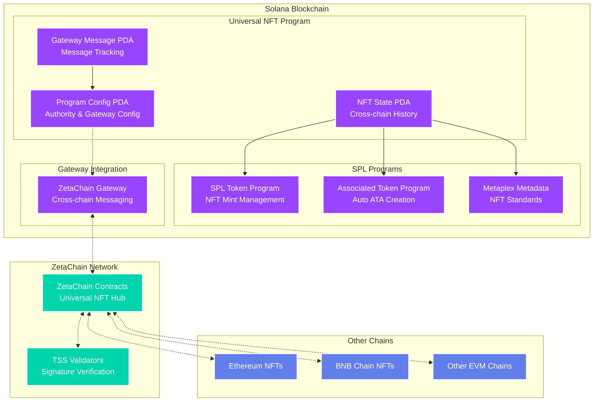
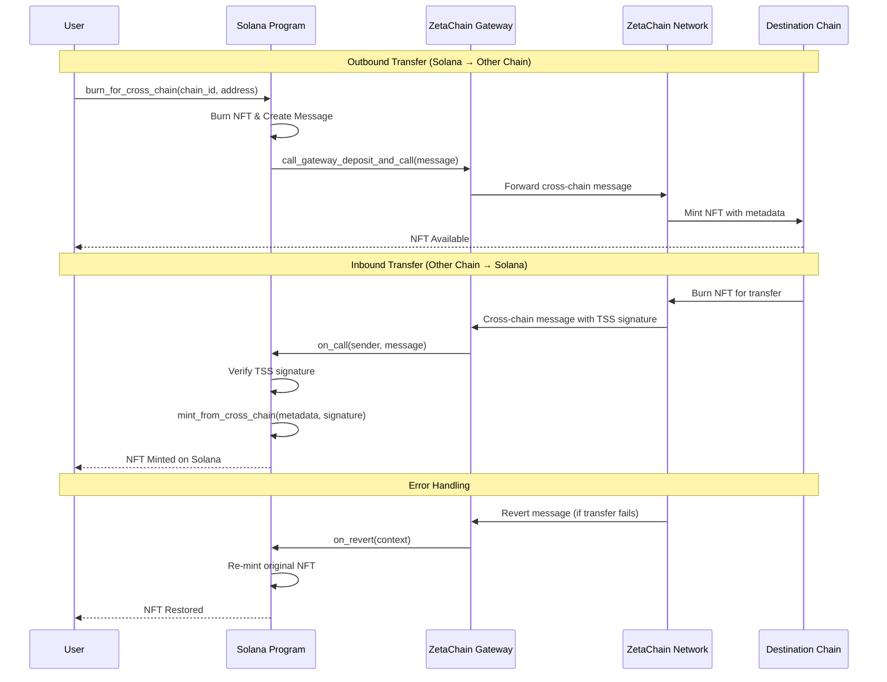
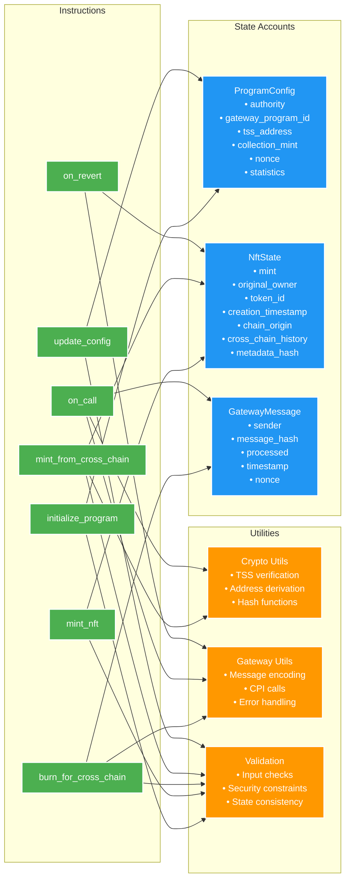
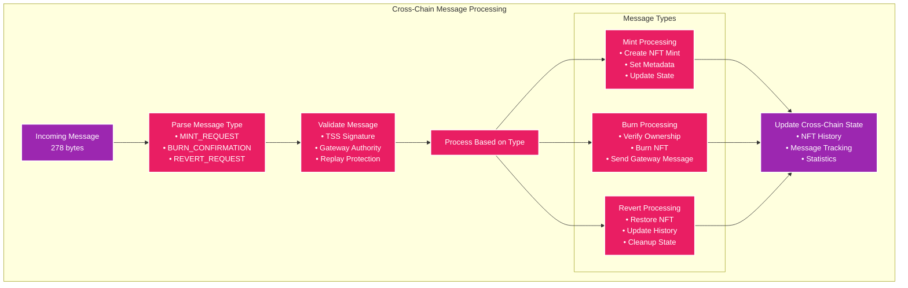
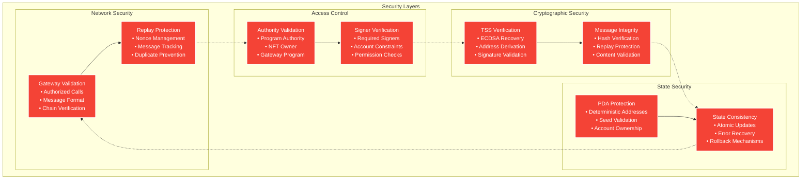

# Universal NFT Program - Architecture Diagrams

## System Architecture Overview

```mermaid
graph TB
    subgraph "Solana Blockchain"
        subgraph "Universal NFT Program"
            PC[Program Config PDA<br/>Authority & Gateway Config]
            NS[NFT State PDA<br/>Cross-chain History]
            GM[Gateway Message PDA<br/>Message Tracking]
        end
        
        subgraph "SPL Programs"
            TOKEN[SPL Token Program<br/>NFT Mint Management]
            ATA[Associated Token Program<br/>Auto ATA Creation]
            META[Metaplex Metadata<br/>NFT Standards]
        end
        
        subgraph "Gateway Integration"
            GW[ZetaChain Gateway<br/>Cross-chain Messaging]
        end
    end
    
    subgraph "ZetaChain Network"
        ZC[ZetaChain Contracts<br/>Universal NFT Hub]
        TSS[TSS Validators<br/>Signature Verification]
    end
    
    subgraph "Other Chains"
        ETH[Ethereum NFTs]
        BNB[BNB Chain NFTs]
        OTHER[Other EVM Chains]
    end
    
    %% Cross-chain connections
    PC -.-> GW
    GW <-.-> ZC
    ZC <-.-> TSS
    ZC <-.-> ETH
    ZC <-.-> BNB
    ZC <-.-> OTHER
    
    %% Internal connections
    NS --> TOKEN
    NS --> ATA
    NS --> META
    GM --> PC
    
    %% Styling
    classDef solana fill:#9945FF,stroke:#fff,stroke-width:2px,color:#fff
    classDef zetachain fill:#00D4AA,stroke:#fff,stroke-width:2px,color:#fff
    classDef ethereum fill:#627EEA,stroke:#fff,stroke-width:2px,color:#fff
    
    class PC,NS,GM,TOKEN,ATA,META,GW solana
    class ZC,TSS zetachain
    class ETH,BNB,OTHER ethereum
```

## Cross-Chain Transfer Flow

```mermaid
sequenceDiagram
    participant User
    participant Solana as Solana Program
    participant Gateway as ZetaChain Gateway
    participant ZetaChain as ZetaChain Network
    participant DestChain as Destination Chain
    
    Note over User, DestChain: Outbound Transfer (Solana → Other Chain)
    
    User->>Solana: burn_for_cross_chain(chain_id, address)
    Solana->>Solana: Burn NFT & Create Message
    Solana->>Gateway: call_gateway_deposit_and_call(message)
    Gateway->>ZetaChain: Forward cross-chain message
    ZetaChain->>DestChain: Mint NFT with metadata
    DestChain-->>User: NFT Available
    
    Note over User, DestChain: Inbound Transfer (Other Chain → Solana)
    
    DestChain->>ZetaChain: Burn NFT for transfer
    ZetaChain->>Gateway: Cross-chain message with TSS signature
    Gateway->>Solana: on_call(sender, message)
    Solana->>Solana: Verify TSS signature
    Solana->>Solana: mint_from_cross_chain(metadata, signature)
    Solana-->>User: NFT Minted on Solana
    
    Note over User, DestChain: Error Handling
    
    ZetaChain->>Gateway: Revert message (if transfer fails)
    Gateway->>Solana: on_revert(context)
    Solana->>Solana: Re-mint original NFT
    Solana-->>User: NFT Restored
```

## Component Relationships

```mermaid
graph LR
    subgraph "Instructions"
        INIT[initialize_program]
        MINT[mint_nft]
        BURN[burn_for_cross_chain]
        MINT_CC[mint_from_cross_chain]
        ON_CALL[on_call]
        ON_REV[on_revert]
        UPDATE[update_config]
    end
    
    subgraph "State Accounts"
        PC_STATE[ProgramConfig<br/>• authority<br/>• gateway_program_id<br/>• tss_address<br/>• collection_mint<br/>• nonce<br/>• statistics]
        
        NFT_STATE[NftState<br/>• mint<br/>• original_owner<br/>• token_id<br/>• creation_timestamp<br/>• chain_origin<br/>• cross_chain_history<br/>• metadata_hash]
        
        GW_STATE[GatewayMessage<br/>• sender<br/>• message_hash<br/>• processed<br/>• timestamp<br/>• nonce]
    end
    
    subgraph "Utilities"
        CRYPTO[Crypto Utils<br/>• TSS verification<br/>• Address derivation<br/>• Hash functions]
        
        GATEWAY_UTILS[Gateway Utils<br/>• Message encoding<br/>• CPI calls<br/>• Error handling]
        
        VALIDATION[Validation<br/>• Input checks<br/>• Security constraints<br/>• State consistency]
    end
    
    %% Instruction connections
    INIT --> PC_STATE
    MINT --> NFT_STATE
    BURN --> GW_STATE
    MINT_CC --> NFT_STATE
    ON_CALL --> GW_STATE
    ON_REV --> NFT_STATE
    UPDATE --> PC_STATE
    
    %% Utility connections
    MINT_CC --> CRYPTO
    ON_CALL --> CRYPTO
    BURN --> GATEWAY_UTILS
    ON_CALL --> GATEWAY_UTILS
    ON_REV --> GATEWAY_UTILS
    
    %% Validation connections
    INIT --> VALIDATION
    MINT --> VALIDATION
    BURN --> VALIDATION
    MINT_CC --> VALIDATION
    UPDATE --> VALIDATION
    
    %% Styling
    classDef instruction fill:#4CAF50,stroke:#fff,stroke-width:2px,color:#fff
    classDef state fill:#2196F3,stroke:#fff,stroke-width:2px,color:#fff
    classDef utility fill:#FF9800,stroke:#fff,stroke-width:2px,color:#fff
    
    class INIT,MINT,BURN,MINT_CC,ON_CALL,ON_REV,UPDATE instruction
    class PC_STATE,NFT_STATE,GW_STATE state
    class CRYPTO,GATEWAY_UTILS,VALIDATION utility
```

## Data Flow Architecture

```mermaid
flowchart TD
    subgraph "Cross-Chain Message Processing"
        MSG_IN[Incoming Message<br/>278 bytes]
        PARSE[Parse Message Type<br/>• MINT_REQUEST<br/>• BURN_CONFIRMATION<br/>• REVERT_REQUEST]
        
        VALIDATE[Validate Message<br/>• TSS Signature<br/>• Gateway Authority<br/>• Replay Protection]
        
        PROCESS[Process Based on Type]
        
        subgraph "Message Types"
            MINT_PROC[Mint Processing<br/>• Create NFT Mint<br/>• Set Metadata<br/>• Update State]
            
            BURN_PROC[Burn Processing<br/>• Verify Ownership<br/>• Burn NFT<br/>• Send Gateway Message]
            
            REV_PROC[Revert Processing<br/>• Restore NFT<br/>• Update History<br/>• Cleanup State]
        end
        
        UPDATE_STATE[Update Cross-Chain State<br/>• NFT History<br/>• Message Tracking<br/>• Statistics]
    end
    
    MSG_IN --> PARSE
    PARSE --> VALIDATE
    VALIDATE --> PROCESS
    
    PROCESS --> MINT_PROC
    PROCESS --> BURN_PROC
    PROCESS --> REV_PROC
    
    MINT_PROC --> UPDATE_STATE
    BURN_PROC --> UPDATE_STATE
    REV_PROC --> UPDATE_STATE
    
    classDef process fill:#E91E63,stroke:#fff,stroke-width:2px,color:#fff
    classDef data fill:#9C27B0,stroke:#fff,stroke-width:2px,color:#fff
    
    class MSG_IN,UPDATE_STATE data
    class PARSE,VALIDATE,PROCESS,MINT_PROC,BURN_PROC,REV_PROC process
```

## Security Architecture

```mermaid
graph TB
    subgraph "Security Layers"
        subgraph "Access Control"
            AUTH[Authority Validation<br/>• Program Authority<br/>• NFT Owner<br/>• Gateway Program]
            SIGNER[Signer Verification<br/>• Required Signers<br/>• Account Constraints<br/>• Permission Checks]
        end
        
        subgraph "Cryptographic Security"
            TSS[TSS Verification<br/>• ECDSA Recovery<br/>• Address Derivation<br/>• Signature Validation]
            HASH[Message Integrity<br/>• Hash Verification<br/>• Replay Protection<br/>• Content Validation]
        end
        
        subgraph "State Security"
            PDA[PDA Protection<br/>• Deterministic Addresses<br/>• Seed Validation<br/>• Account Ownership]
            STATE[State Consistency<br/>• Atomic Updates<br/>• Error Recovery<br/>• Rollback Mechanisms]
        end
        
        subgraph "Network Security"
            GATEWAY[Gateway Validation<br/>• Authorized Calls<br/>• Message Format<br/>• Chain Verification]
            REPLAY[Replay Protection<br/>• Nonce Management<br/>• Message Tracking<br/>• Duplicate Prevention]
        end
    end
    
    %% Security relationships
    AUTH --> SIGNER
    TSS --> HASH
    PDA --> STATE
    GATEWAY --> REPLAY
    
    %% Cross-layer connections
    SIGNER -.-> TSS
    HASH -.-> STATE
    STATE -.-> GATEWAY
    REPLAY -.-> AUTH
    
    classDef security fill:#F44336,stroke:#fff,stroke-width:2px,color:#fff
    class AUTH,SIGNER,TSS,HASH,PDA,STATE,GATEWAY,REPLAY security
```