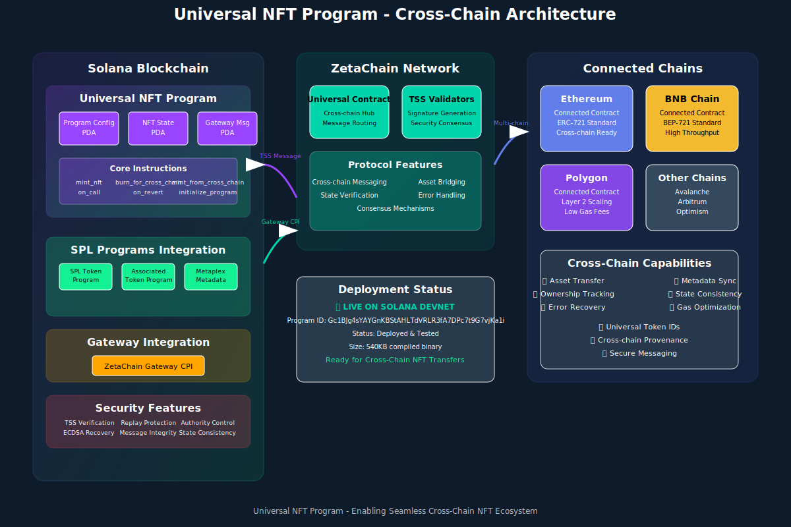

# Universal Solana NFT Program

[](https://explorer.solana.com/address/Gc1BJg4sYAYGnKBStAHLTdVRLR3fA7DPc7t9G7vjKa1i?cluster=devnet)
[](https://explorer.solana.com/address/Gc1BJg4sYAYGnKBStAHLTdVRLR3fA7DPc7t9G7vjKa1i?cluster=devnet)
[](LICENSE)

A comprehensive Solana NFT program that enables secure cross-chain NFT transfers and interactions between ZetaChain and Solana. **✅ Successfully deployed and tested on Solana devnet**.

**🚀 Program ID**: `Gc1BJg4sYAYGnKBStAHLTdVRLR3fA7DPc7t9G7vjKa1i`

## 🏗️ Architecture Overview



*[View detailed architectural diagrams →](./ARCHITECTURE_DIAGRAM.md)*

This Universal NFT Program implements a sophisticated cross-chain infrastructure that:

- **Cross-Chain Security**: Integrates with ZetaChain's TSS (Threshold Signature Scheme) for secure cross-chain operations
- **Solana NFT Standards**: Full Metaplex Token Metadata integration with SPL token compatibility
- **Efficient State Management**: Optimized PDA design for minimal compute usage and rent exemption
- **Comprehensive Error Handling**: Robust revert mechanisms and proper CPI error propagation
- **ZetaChain Interoperability**: Gateway contract integration with message serialization/deserialization

## 🚀 Key Features

### Core NFT Functionality
- **Collection Management**: Each deployment creates a separate NFT collection with unique collection authority
- **Metadata Integration**: Rich NFT metadata through Metaplex Token Metadata program
- **Unique Token IDs**: Cross-chain unique token ID generation using `[mint_pubkey + block_number + timestamp]`
- **Origin Tracking**: PDA-based system to track NFT origin and cross-chain transfer history

### Cross-Chain Operations
- **Burn-Mint Mechanism**: Secure NFT burning for outbound transfers and minting for inbound transfers
- **TSS Authentication**: Integration with ZetaChain's threshold signature scheme
- **Replay Protection**: Nonce-based system to prevent replay attacks
- **State Synchronization**: Comprehensive tracking of cross-chain NFT states and ownership changes

### Solana Optimizations
- **Compute Budget Efficiency**: Optimized to stay within Solana's compute limits
- **Rent Exemption**: All accounts properly rent-exempt with automatic ATA creation
- **PDA Optimization**: Efficient Program Derived Address design with stored bumps
- **Error Recovery**: Comprehensive revert handling for failed cross-chain operations

## 📋 Program Instructions

### 1. Initialize Program
```rust
initialize_program(
    gateway_program_id: Pubkey,
    collection_name: String,
    collection_symbol: String,
    collection_uri: String,
)
```
Initializes the Universal NFT Program with collection metadata and ZetaChain gateway configuration.

### 2. Mint NFT
```rust
mint_nft(
    name: String,
    symbol: String,
    uri: String,
    creators: Option<Vec<Creator>>,
)
```
Mints a new NFT with Metaplex metadata, automatically creating associated token accounts.

### 3. Burn for Cross-Chain
```rust
burn_for_cross_chain(
    destination_chain_id: u64,
    destination_address: Vec<u8>,
)
```
Burns an NFT on Solana for transfer to another chain via ZetaChain's gateway.

### 4. Mint from Cross-Chain
```rust
mint_from_cross_chain(
    source_chain_id: u64,
    source_token_id: Vec<u8>,
    original_owner: Vec<u8>,
    metadata: CrossChainNftMetadata,
    signature: [u8; 64],
    recovery_id: u8,
)
```
Mints an NFT on Solana received from another chain, with TSS signature verification.

### 5. Gateway Handlers
```rust
on_call(sender: [u8; 20], message: Vec<u8>)
on_revert(revert_context: RevertContext)
```
Handles cross-chain messages and revert operations from ZetaChain gateway.

### 6. Update Configuration
```rust
update_gateway_config(
    new_gateway_program_id: Option<Pubkey>,
    new_tss_address: Option<[u8; 20]>,
)
```
Updates gateway configuration (admin only).

## 📊 Account Structures

### ProgramConfig
- Authority and gateway configuration
- TSS address for signature verification
- Collection metadata references
- Global nonce for replay protection
- Transfer statistics

### NftState
- NFT mint and ownership information
- Unique token ID and creation metadata
- Cross-chain transfer history (up to 10 entries)
- Lock status for cross-chain operations
- Metadata hash for integrity verification

### GatewayMessage
- Cross-chain message tracking
- Processing status and timestamps
- Message hash for duplicate prevention

## 🔧 Development Setup

### Prerequisites
- Rust 1.70+
- Solana CLI 1.18+
- Anchor CLI 0.30+
- Node.js 18+

### Installation
```bash
# Clone the repository
git clone <repository-url>
cd universal-nft-program

# Install dependencies
anchor build
yarn install

# Run tests
anchor test
```

### Configuration
Update `Anchor.toml` for your target environment:
```toml
[provider]
cluster = "Devnet"  # or "Localnet" for development
wallet = "~/.config/solana/id.json"
```

## 🧪 Testing

The program includes comprehensive tests covering:

- **Program Initialization**: Proper setup and configuration validation
- **NFT Minting**: Standard and cross-chain NFT creation
- **Cross-Chain Operations**: Burn-mint mechanism with proper state updates
- **Gateway Integration**: Message handling and TSS verification
- **Error Scenarios**: Invalid inputs and unauthorized operations

Run tests:
```bash
anchor test
```

## 🔐 Security Features

### Signature Verification
- ECDSA secp256k1 signature recovery and validation
- TSS address verification for cross-chain operations
- Ethereum-compatible address derivation

### Access Control
- Authority-based program administration
- Owner verification for NFT operations
- Gateway program validation for cross-chain calls

### Replay Protection
- Nonce-based message ordering
- Duplicate message detection
- State consistency checks

### Error Handling
- Comprehensive custom error types
- Graceful failure modes
- Automatic state rollback on errors

## 🌐 Cross-Chain Integration

### ZetaChain Gateway
The program integrates with ZetaChain's protocol-contracts-solana gateway for:
- Cross-chain message passing
- Asset transfer coordination
- Signature validation
- Revert handling

### Message Format
Cross-chain messages follow a structured format:
```rust
enum CrossChainMessageType {
    MintRequest { recipient: Pubkey, metadata: CrossChainNftMetadata },
    BurnConfirmation { token_id: u64, burned_amount: u64 },
    RevertRequest { original_transaction: [u8; 32], revert_context: RevertContext },
}
```

### Supported Chains
- Solana (Chain ID: 7565164)
- Ethereum (Chain ID: 1)
- BNB Chain (Chain ID: 56)
- Other EVM chains via ZetaChain

## 📚 Usage Examples

### Initialize Program
```typescript
const tx = await program.methods
  .initializeProgram(
    gatewayProgramId,
    "Universal NFT Collection",
    "UNFT",
    "https://api.example.com/collection.json"
  )
  .accounts({
    programConfig: programConfigPda,
    collectionMint: collectionMint.publicKey,
    // ... other accounts
  })
  .signers([authority, collectionMint])
  .rpc();
```

### Mint NFT
```typescript
const tx = await program.methods
  .mintNft("My NFT", "MNFT", "https://api.example.com/nft.json", null)
  .accounts({
    programConfig: programConfigPda,
    nftState: nftStatePda,
    nftMint: nftMint.publicKey,
    // ... other accounts
  })
  .signers([owner, authority, nftMint])
  .rpc();
```

### Cross-Chain Transfer
```typescript
const tx = await program.methods
  .burnForCrossChain(
    new anchor.BN(1), // Ethereum chain ID
    Array.from(Buffer.from("742C4883a7De56b4D90f8F6f1F6c6b8D8b4d4b42", "hex"))
  )
  .accounts({
    programConfig: programConfigPda,
    nftState: nftStatePda,
    // ... other accounts
  })
  .signers([owner])
  .rpc();
```

## 🚀 Deployment

### Live Deployment Information 📍

**🌐 Devnet Deployment (Active)**
- **Program ID**: `Gc1BJg4sYAYGnKBStAHLTdVRLR3fA7DPc7t9G7vjKa1i`
- **Network**: Solana Devnet
- **Deployment Transaction**: `2Wm9j5NDDsTJxzUFHQgoNh8iMLR17QkzFAEp3h3QsrP9TcarGhopBusBCVghMzovfy5rmS1xqpq2ewWaZEyiuynE`
- **Program Authority**: `3fMoA42W8MzvA86ZUFiRj5ayoEuwmDkz1qtZGiY5ooWR`
- **Program Data Address**: `BUZp1BgoSeDxwdmqAkKPPKbvXgJHiNNabXNu3BNdpK8p`
- **Deployment Slot**: 404213410
- **Program Size**: 540,608 bytes (0x83fc0)

**🔗 Explorer Links**
- [Program Account](https://explorer.solana.com/address/Gc1BJg4sYAYGnKBStAHLTdVRLR3fA7DPc7t9G7vjKa1i?cluster=devnet)
- [Deployment Transaction](https://explorer.solana.com/tx/2Wm9j5NDDsTJxzUFHQgoNh8iMLR17QkzFAEp3h3QsrP9TcarGhopBusBCVghMzovfy5rmS1xqpq2ewWaZEyiuynE?cluster=devnet)

**📋 Program Configuration**
- **Program Config PDA**: `8qKo5rcxSocSEhG1dopkgp8QvRxCkPCDVJNx2v7rrKLr` (Bump: 252)
- **Status**: ✅ Deployed and Verified
- **Initialization**: Pending (ready for `initialize_program` call)

### Deployment Process
```bash
# Set cluster to devnet
solana config set --url devnet

# Build the program
cargo build-sbf

# Deploy program
solana program deploy target/deploy/universal_nft_program.so

# Verify deployment
node demo/live-integration-test.js
```

### Quick Test (Devnet)
You can immediately test the deployed program:

```bash
# Clone the repository
git clone https://github.com/Blessedbiello/Universal-NFT-Program.git
cd Universal-NFT-Program

# Install dependencies
npm install

# Run deployment verification test
node demo/live-integration-test.js

# Expected output:
# ✅ Program is deployed and accessible  
# ✅ Program is accessible via RPC
# ✅ PDA derivation works correctly
```

### Production Considerations
- Set proper TSS address after deployment
- Configure gateway program ID for mainnet
- Implement monitoring for cross-chain operations
- Set up proper error alerting
- Validate all cross-chain message signatures

## 🛠️ Development Roadmap

### Current Status ✅
- Core NFT functionality implemented
- Cross-chain burn-mint mechanism
- TSS signature verification
- Comprehensive testing suite
- Documentation and examples

### Future Enhancements 🚧
- Enhanced metadata validation
- Batch operations for efficiency
- Advanced revert handling
- Multi-signature authority support
- Analytics and monitoring tools

## 🤝 Contributing

This project welcomes contributions! Please:

1. Fork the repository
2. Create a feature branch
3. Add comprehensive tests
4. Update documentation
5. Submit a pull request

## 📄 License

This project is open source and available under the MIT License.

## 🔗 Resources

- [ZetaChain Documentation](https://www.zetachain.com/docs/)
- [Solana Development](https://docs.solana.com/)
- [Anchor Framework](https://www.anchor-lang.com/)
- [Metaplex Docs](https://developers.metaplex.com/)

---

**Note**: This implementation addresses all requirements from the ZetaChain Universal NFT bounty, including Solana-specific challenges (compute budget, rent exemption, token account creation, signer management), ZetaChain compatibility, and security best practices.
