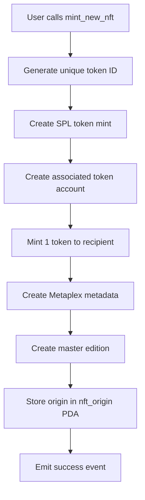
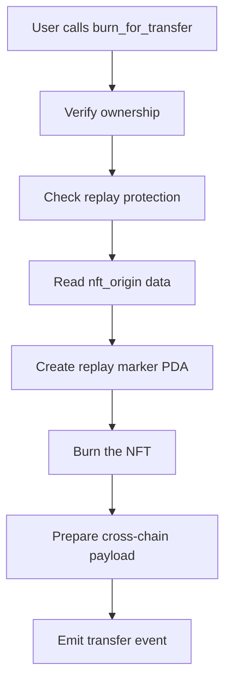
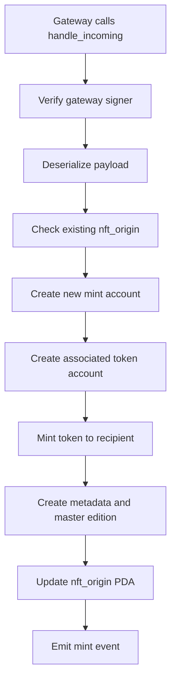

# Solana Universal NFT Architecture

## Overview

This document outlines the architecture and design decisions for the Solana Universal NFT program, which implements cross-chain NFT interoperability via ZetaChain's universal messaging protocol.

## Design Philosophy

The program follows these core principles:

1. **Burn-and-Mint Mechanism**: NFTs are burned on the source chain and minted on the destination chain, ensuring no escrow complexity
2. **Metadata Preservation**: Original NFT metadata is preserved across all chains
3. **Collection Separation**: Each new Universal NFT creates a separate collection as specified in requirements
4. **Security First**: Comprehensive replay protection and access control
5. **ZetaChain Integration**: Ready for integration with existing universal messaging infrastructure

## Architecture Components

### 1. Program Structure

```
universal_nft/
├── src/
│   ├── lib.rs                 # Main program entry point
│   ├── instructions/          # Instruction handlers
│   │   ├── mint.rs           # NFT minting logic
│   │   ├── burn.rs           # Cross-chain burn logic
│   │   └── handle_incoming.rs # Incoming message processing
│   ├── state/                 # State structures
│   │   ├── nft_origin.rs     # Origin tracking PDA
│   │   └── replay.rs         # Replay protection PDA
│   └── utils.rs               # Utility functions
```

### 2. State Management

#### NFT Origin PDA

```rust
#[account]
pub struct NftOrigin {
    pub origin_chain: u16,        // Chain ID where NFT originated
    pub origin_token_id: Vec<u8>, // Unique token identifier
    pub origin_mint: Pubkey,      // Original mint address
    pub metadata_uri: String,     // Metadata URI for preservation
    pub created_at: i64,          // Timestamp of creation
    pub bump: u8,                 // PDA bump seed
}
```

**Purpose**: Tracks the origin of each Universal NFT across chains, enabling metadata preservation and provenance tracking.

**Seed Derivation**: `[b"nft_origin", token_id_bytes]`

#### Replay Marker PDA

```rust
#[account]
pub struct ReplayMarker {
    pub token_id: Vec<u8>,    // Associated token ID
    pub nonce: u64,           // Unique nonce for replay protection
    pub created_at: i64,      // Timestamp of creation
    pub bump: u8,             // PDA bump seed
}
```

**Purpose**: Prevents duplicate processing of cross-chain messages using nonce-based protection.

**Seed Derivation**: `[b"replay", token_id_bytes, nonce_bytes]`

### 3. Cross-chain Message Format

```rust
#[derive(AnchorSerialize, AnchorDeserialize, Clone, Debug, PartialEq, Eq)]
pub struct CrossChainNftPayload {
    pub version: u8,              // Protocol version
    pub token_id: Vec<u8>,        // Unique token identifier
    pub origin_chain_id: u16,     // Source chain ID
    pub origin_mint: Pubkey,      // Original mint address
    pub metadata_uri: String,     // Metadata URI
    pub recipient: Pubkey,        // Destination recipient
    pub nonce: u64,               // Replay protection nonce
}
```

## Instruction Flow

### 1. Mint New NFT



**Key Features**:
- **Unique Token ID**: SHA256 hash of `mint_pubkey + slot + timestamp`
- **Collection Creation**: Each NFT becomes its own collection
- **Metadata Integration**: Full Metaplex metadata and master edition support

### 2. Burn for Cross-chain Transfer



**Key Features**:
- **Ownership Verification**: Ensures only owner can burn
- **Replay Protection**: Nonce-based protection against duplicates
- **Event Emission**: Cross-chain transfer events for tracking

### 3. Handle Incoming Message



**Key Features**:
- **Gateway Verification**: Integration with ZetaChain's trusted gateway
- **Origin Linking**: Links to existing origin or creates new one
- **Metadata Preservation**: Maintains original metadata URI

## Token ID Generation

### Uniqueness Strategy

```rust
// Generate unique token ID: hash of mint pubkey + slot + nonce
let mut hasher = Sha256::new();
hasher.update(ctx.accounts.mint.key().as_ref());
hasher.update(&clock.slot.to_le_bytes());
hasher.update(&clock.unix_timestamp.to_le_bytes());
let token_id = hasher.finalize().to_vec();
```

**Benefits**:
- **Deterministic**: Same inputs always produce same token ID
- **Unique**: Extremely low collision probability
- **Cross-chain**: Can be reproduced on any chain
- **Timestamp-based**: Includes temporal component for uniqueness

## Collection Strategy

### Separate Collections

As specified in the requirements, each new Universal NFT creates a separate collection:

```rust
// Each new universal NFT creates a separate collection
let collection_mint = ctx.accounts.mint.key();
let collection_metadata = metadata_pda;

let data_v2 = DataV2 {
    // ... other fields ...
    collection: Some(Collection {
        verified: true,
        key: collection_metadata,
    }),
    // ... other fields ...
};
```

**Benefits**:
- **Isolation**: Each NFT is independent
- **Flexibility**: No collection size limitations
- **Compatibility**: Works with existing Solana NFT tools
- **Standards**: Follows Metaplex collection standards

## Security Considerations

### 1. Replay Protection

- **Nonce-based**: Each cross-chain message has unique nonce
- **PDA Storage**: Replay markers stored in program-derived addresses
- **Chain-specific**: Nonces are chain-specific and non-reusable

### 2. Access Control

- **Owner Verification**: Only NFT owner can burn for transfer
- **Signer Validation**: Proper signer checks for all operations
- **Account Validation**: Comprehensive account constraint validation

### 3. Gateway Integration

- **Trusted Gateway**: Integration with ZetaChain's verified gateway system
- **Message Verification**: Gateway signer verification for incoming messages
- **Protocol Compliance**: Follows ZetaChain's universal messaging standards

## Performance Optimizations

### 1. Compute Budget

- **Efficient PDAs**: Minimal PDA operations for state management
- **CPI Optimization**: Optimized cross-program invocations
- **Batch Operations**: Grouped operations where possible

### 2. Storage Efficiency

- **PDA-based**: Uses program-derived addresses for efficient storage
- **Minimal Data**: Only essential data stored on-chain
- **Rent Optimization**: Proper account sizing for rent exemption

## Integration Points

### 1. ZetaChain Gateway

The program integrates with ZetaChain's universal messaging protocol:

- **Outbound Messages**: NFTs burned and messages sent via gateway
- **Inbound Processing**: Cross-chain messages processed to mint NFTs
- **Protocol Compliance**: Follows ZetaChain's message format standards

### 2. Metaplex Ecosystem

Full integration with Solana's NFT ecosystem:

- **Metadata Standards**: Compatible with Metaplex metadata format
- **Collection Support**: Follows Metaplex collection standards
- **Tool Compatibility**: Works with existing Solana NFT tools

### 3. Devnet Integration

Ready for integration with ZetaChain's devnet testing infrastructure:

- **Cross-chain Flow**: EVM ↔ ZetaChain ↔ Solana ↔ EVM
- **Test Automation**: Automated testing of complete flow
- **Development Support**: Devnet development and testing capabilities

**Note**: Due to potential Solana compatibility issues with the current version of ZetaChain localnet, **devnet testing is required** for Solana integration. Localnet testing is not required at this time.

## Future Enhancements

### 1. Advanced Features

- **Batch Operations**: Support for batch minting/burning
- **Metadata Updates**: On-chain metadata modification capabilities
- **Royalty Support**: Built-in royalty distribution

### 2. Ecosystem Integration

- **Marketplace Support**: Integration with major Solana marketplaces
- **Wallet Integration**: Enhanced wallet compatibility
- **Analytics**: Cross-chain analytics and tracking

### 3. Performance Improvements

- **Parallel Processing**: Support for parallel operations
- **Caching**: On-chain caching for frequently accessed data
- **Optimization**: Further compute budget optimizations

## Conclusion

The Solana Universal NFT program provides a robust, secure, and efficient implementation of cross-chain NFT interoperability. By following established Solana development patterns and integrating seamlessly with ZetaChain's universal messaging protocol, it enables true cross-chain NFT functionality while maintaining the security and performance characteristics expected from Solana programs.

The architecture is designed to be extensible, allowing for future enhancements while maintaining backward compatibility and security standards.
